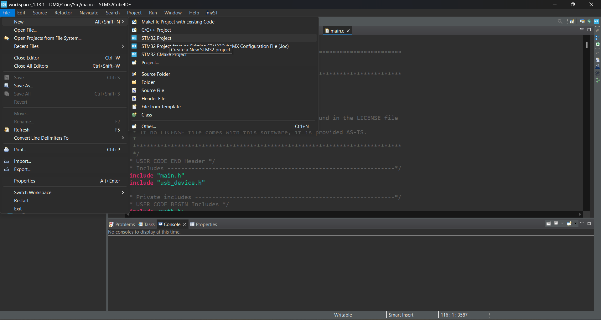

Xin chào! Đây là bài blog đầu tiên của tôi trên GitHub Pages.
Hôm nay tôi sẽ viết blog về RTOS trên STM32.

I. Lý thuyết
1. RTOS là gì?
RTOS là viết tắt của Real-Time Operating System, hay còn gọi là Hệ điều hành thời gian thực. RTOS là một loại hệ điều hành được thiết kế để xử lý các tác vụ đúng thời hạn, tức là đảm bảo rằng các tác vụ quan trọng được thực hiện trong một khoảng thời gian xác định. Điều này rất quan trọng trong các hệ thống nhúng, thiết bị điều khiển công nghiệp, robot, thiết bị y tế, ô tô, v.v.

2. Đặc điểm chính của RTOS:
Định thời chính xác (Deterministic): RTOS phải đảm bảo phản hồi trong một thời gian giới hạn, thường tính bằng mili-giây hoặc micro-giây.
Đa tác vụ (Multitasking): Có thể chạy nhiều tiến trình (task) song song và chuyển đổi giữa chúng nhanh chóng.
Bộ lập lịch ưu tiên (Priority-based Scheduling): Các tác vụ có độ ưu tiên cao hơn được ưu tiên thực thi.
Preemptive hoặc Cooperative: Có thể giành quyền điều khiển CPU từ task khác (preemptive) hoặc nhường quyền (cooperative).
Bộ nhớ và tài nguyên hiệu quả: RTOS được thiết kế để sử dụng ít bộ nhớ và tài nguyên.

3. Một số RTOS phổ biến:
FreeRTOS – mã nguồn mở, phổ biến trong các hệ thống nhúng.
VxWorks – dùng trong các ứng dụng công nghiệp và quốc phòng.
RTEMS, Zephyr, Micrium µC/OS, QNX, v.v.

4. Ứng dụng của RTOS:
Thiết bị IoT
Hệ thống điều khiển xe hơi (ABS, ECU, v.v.)
Robot công nghiệp
Thiết bị y tế
Hệ thống nhúng thời gian thực (ví dụ: máy bay, tên lửa)

II. Thực hành
1. Tạo project mới

