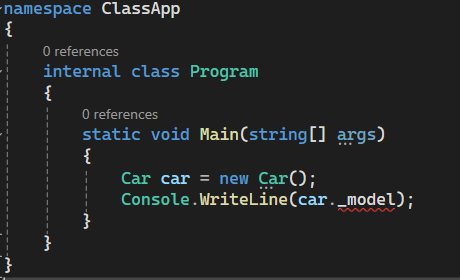
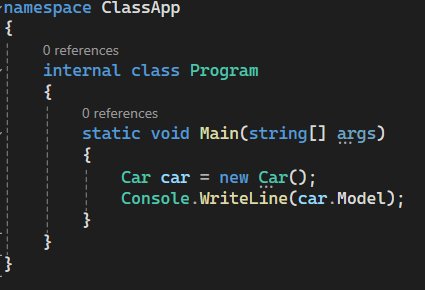

What is a class?
- A class is a blue print of an Object
- It has properties - so called member variables
- It has actions/ abilities - so called member functions or methods
- Inheritance possible
- Can be used as a Datatype
What is an Object?
- An Object is an instance of a class
- For example, we create a class called Car. Then, we create a variable of type Car. That variable is called an object of class Car.

Car.cs
```C#
using System;
using System.Collections.Generic;
using System.Linq;
using System.Text;
using System.Threading.Tasks;

namespace ClassApp
{   
    internal class Car
    {
         
    }
}
```

Program.cs
```C#
namespace ClassApp
{
    internal class Program
    {
        static void Main(string[] args)
        {
            Car car = new Car();

        }
    }
}
```

A class can be imagined like a real-world object. Like a Car can have brand, model, speed, etc... Therefore, we can create properties for a class too.

What is a member variable?
A member variable (also called a field) is a variable inside of a class, but outside of a method.

For example, we have a Car class with a field called _model. By convention, we often use a undercore in front of a field name. Ofcourse, you can use any names that you like. We use a private modifier to prevent access from other class, only methods in the Car class can access this variable.


```C#
using System;
using System.Collections.Generic;
using System.Linq;
using System.Text;
using System.Threading.Tasks;

namespace ClassApp
{   
    internal class Car
    {
        //private hides the variable from other classes
        private string _brand;
        private string _model;
        private int speed;        
    }
}
```

Since we use private for member variables we cannot access it.


To access member variables or fields, we can use properties
Type "prop" and then Tab in the Car class to define a property quickly
we use public modifier for properties and name properties as member varialbes with upper case for the first letter

```C#
    using System;
    using System.Collections.Generic;
    using System.Linq;
    using System.Text;
    using System.Threading.Tasks;

    namespace ClassApp
    {   
        internal class Car
        {
            //private hides the variable from other classes
            private string _brand;
            private string _model;
            private int _speed;

            public string Brand { get; set; }
            public string Model { get; set; }
            public int Speed { get; set; }


        }
    }
```
Now we can access member variables through properties

Properties can be treated as a door. When you want to talk with a member variable you have to open the door. It helps prevent member variables from invalid assignments and accesses.

Now let's talk about Constructor.
A constructor is a function which is automatically called when an object is created.
A constructor is defined as a function but with no return type.
```C#
using System;
using System.Collections.Generic;
using System.Linq;
using System.Text;
using System.Threading.Tasks;

namespace ClassApp
{   
    internal class Car
    {
        //private hides the variable from other classes
        private string _brand;
        private string _model;
        private int _speed;

        public string Brand { get; set; }
        public string Model { get; set; }
        public int Speed { get; set; }

        public Car()
        {
            Console.WriteLine("A car has been created!");
        }
    }
}
```
We also have constructors with parameters
```C#
using System;
using System.Collections.Generic;
using System.Linq;
using System.Text;
using System.Threading.Tasks;

namespace ClassApp
{   
    internal class Car
    {
        //private hides the variable from other classes
        private string _brand;
        private string _model;
        private int _speed;

        public string Brand { get; set; }
        public string Model { get; set; }
        public int Speed { get; set; }

        public Car()
        {
            Console.WriteLine("A car has been created!");
        }
        public Car(string brand, string model, int speed)
        {
            Brand = brand;
            Model = model;
            Speed = speed;
        }
    }
}
```
It helps propgramer can define an object in multiple ways.


